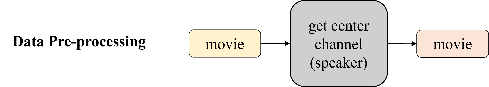
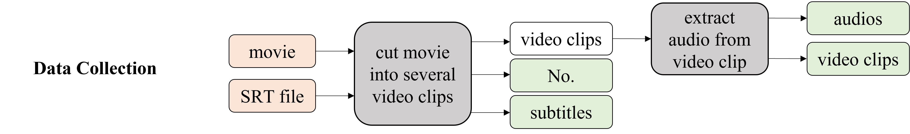
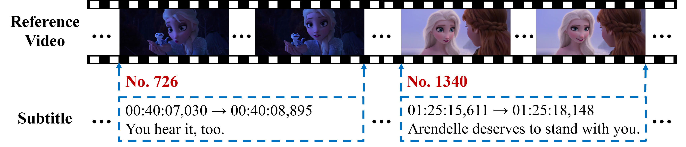
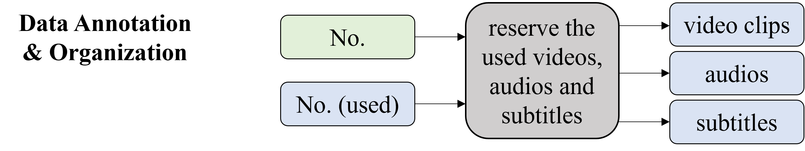
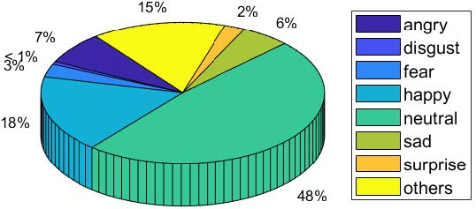
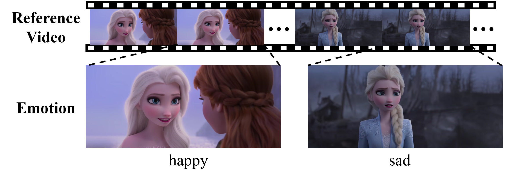
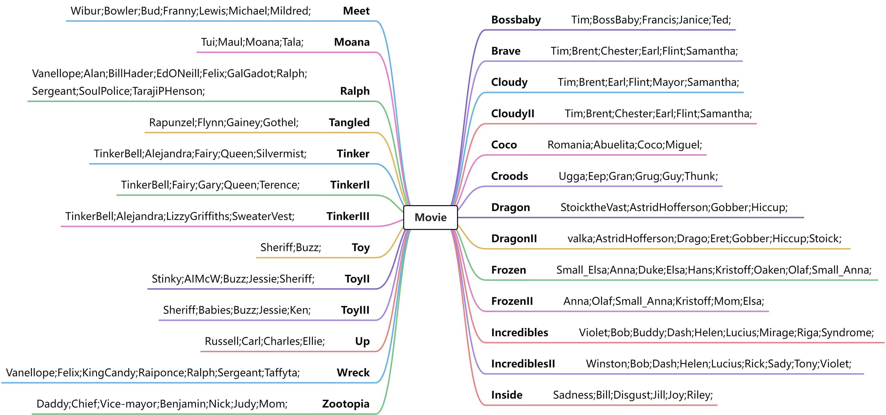

# V2C

Pytorch implementation for “V2C: Visual Voice Cloning”

## 1. V2C-Animation Dataset Construction

### (1) Overall processes of dataset

The overall processes of V2C-Animation dataset can be divided into three parts: 1) data pre-processing, 2) data collection, and 3) data annotation & organization.

#### 1) data pre-processing

<p align="center">

</p>
<p align="center">
Figure: The process of data pre-processing.
</p>

To alleviate the impact from the background music, we only extract the sound channel of the center speaker, which mainly focuses on the sound of the speaking character. In practice, we use Adobe Premiere Pro (Pr) to extract the voice of center speaker.

<p align="center">

</p>
<p align="center">
Figure: 5.1 surround sound.
</p>

As shown in the above image, 5.1 surround sound has 6 sound channels, and so 6 speakers. It includes a center speaker, subwoofer (for low frequency effects, such as explosions), left and right front speakers, and left and right rear speakers. (These image and text are from [https://www.diffen.com](https://www.diffen.com/difference/5.1_Surround_Sound_vs_7.1_Surround_Sound))

#### 2) data collection

<p align="center">

</p>
<p align="center">
Figure: The process of data collection.
</p>

We search for animated movies with the corresponding subtitles and then select a set of 26 movies of diverse genres. Specifically, we first cut the movies into a series of video clips according to the subtitle files. Here, we use an SRT type subtitle file. In addition to subtitles/texts, the SRT file also contains starting and ending time-stamps to ensure the subtitles match with video and audio, and sequential number of subtitles (e.g., No. 726 and No. 1340 in Figure), which indicates the index of each video clip. Based on the SRT file, we cut the movie into a series of video clips using the FFmpeg toolkit (an automatic audio and video processing toolkit) and then extract the audio from each video clip by FFmpeg as well.

<p align="center">

</p>
<p align="center">
Figure: Examples of how to cut a movie into a series of video clips according to subtitle files. Note that the subtitle files contain both starting and ending time-stamps for each video clip.
</p>

#### 3) data annotation & organization


<p align="center">

</p>
<p align="center">
Figure: The processes of data annotation and organization.
</p>

Inspired by the organization of LibriSpeech dataset, we categorize the obtained video clips, audios and subtitles into their corresponding characters (i.e., speakers) via a crowd-sourced service. To ensure that the characters appeared in the video clips are the same as the speaking ones, we manually remove the data example that does not satisfy the requirement. Then, following the categories of FER-2013 (a dataset for human facial expression recognition), we divide the collected video/audio clips into 8 types including angry, happy, sad, etc.  In this way, we totally collect a dataset with 10,217 video clips with paired audios and subtitles.  All of the annotations, time-stamps of the mined movie clips and a tool to extract the triplet data will be released.

<p align="center">

</p>
<p align="center">
Figure: Distribution of emotion labels on V2C-Animation.
</p>

We divide the collected video/audio clips into 8 types (i.e., 0: angry, 1: disgust, 2: fear, 3: happy, 4: neutral, 5: sad, 6: surprise, and 7: others). The corresponding emotion labels for the video clips are in emotions.json.

<p align="center">

</p>
<p align="center">
Figure: Samples of the character's emotion (e.g., happy and sad) involved in the reference video. Here, we take Elsa (a character in movie Frozen) as an example.
</p>

### (2) Organization of V2C-Animation dataset

Run the following code, which can produce and organize the data automatically. The name of the movie in the movie_path should be the same as the SRT files in the SRT_path.

```
python toolkit_data.py --SRT_path (path_of_SRT_files) --movie_path (path_of_movies) --output_path (path_of_output_data)
```
Note that this code involves the processes 2 and 3 only. Thus, we need to make a pre-processing according to the process 1 above to remove the background music and then reserve the voice of center speaker in the movie.

The organization of V2C-Animation dataset:

<p align="center">

</p>
<p align="center">
Figure: Movies with the corresponding speakers/characters on the V2C-Animation dataset.
</p>

```
<root>
    |
    .- movie_dataset/
               |
               .- zootopia/
               |   |
               |   .- zootopia_speeches/
               |   |   |
	           |   |   .- Daddy/
	           |   |   |   |
	           |   |   |   .- 00/
	           |   |   |        |
	           |   |   |        .- Daddy-00.trans.txt
	           |   |   |        |    
	           |   |   |        .- Daddy-00-0034.wav
	           |   |   |        |
	           |   |   |        .- Daddy-00-0034.normalized.txt
	           |   |   |        |
	           |   |   |        .- Daddy-00-0036.wav
	           |   |   |    	|
	           |   |   |    	.- Daddy-00-0036.normalized.txt
	           |   |   |    	|
	           |   |   |        ...
	           |   |   |
	           |   |   .- Judy/
	           |   |       | ...
	           |   |	               
               |   |
               |   .- zootopia_videos/
               |       |
               |       .- Daddy/
               |       |   |
               |       |   .- 0034.mp4
               |       |   |
               |       |   .- 0036.mp4
               |       |   |
               |       |   ...
               |       .- Judy/
               |           | ...
               | ...
```


### (3) Links of animated movies

We provide the hyperlink of each animated movies on the V2C-Animation dataset.

[Bossbaby](https://www.microsoft.com/en-au/p/the-boss-baby/8d6kgwxblb9q?activetab=pivot%3aoverviewtab), [Brave](https://www.microsoft.com/en-us/p/brave/8D6KGWZL5W0P/006F?activetab=pivot:overviewtab), [Cloudy](https://www.microsoft.com/en-au/p/cloudy-with-a-chance-of-meatballs/8d6kgwzl62j4?activetab=pivot%3aoverviewtab), [CloudyII](https://www.microsoft.com/en-au/p/cloudy-with-a-chance-of-meatballs-cloudy-with-a-chance-of-meatballs-2/8d6kgwztwz7z?activetab=pivot%3aoverviewtab), [COCO](https://www.microsoft.com/en-us/p/onward-coco-bundle/8d6kgwxn1rqf?activetab=pivot%3aoverviewtab), [Croods](https://www.microsoft.com/en-au/p/the-croods-a-new-age/8d6kgwxn81pl?activetab=pivot%3aoverviewtab), [Dragon](https://www.microsoft.com/en-au/p/how-to-train-your-dragon/8d6kgwzl5w15?activetab=pivot%3aoverviewtab), [DragonII](https://www.microsoft.com/en-au/p/how-to-train-your-dragon-2/8d6kgwzm9xxg?activetab=pivot%3aoverviewtab), [Frozen](https://www.microsoft.com/en-au/p/frozen-2013/8d6kgwzkhjg9?activetab=pivot%3aoverviewtab), [FrozenII](https://www.microsoft.com/en-au/p/frozen-ii/8d6kgwxn0hk0?activetab=pivot%3aoverviewtab), [Incredibles](https://www.microsoft.com/en-us/p/the-incredibles/8d6kgwzl5sxd?activetab=pivot%3aoverviewtab), [IncrediblesII](https://www.microsoft.com/en-us/p/incredibles-2/8d6kgwxn250g?activetab=pivot%3aoverviewtab), [Inside](https://www.microsoft.com/en-us/p/inside-out-bonus/8d6kgx06gplg?activetab=pivot%3aoverviewtab), [Meet](https://www.microsoft.com/en-au/p/meet-the-robinsons/8d6kgwzl58bd?activetab=pivot%3aoverviewtab), [Moana](https://www.microsoft.com/en-au/p/moana/8d6kgx0m8tzw?activetab=pivot%3aoverviewtab), [Ralph](https://www.microsoft.com/en-au/p/ralph-breaks-the-internet-bonus/8d6kgwxn43d7?activetab=pivot%3aoverviewtab), [Tangled](https://www.microsoft.com/en-au/p/tangled/8d6kgwzl596v?activetab=pivot%3aoverviewtab), [Tinker](https://www.microsoft.com/en-au/p/tinker-bell/8d6kgwzl62rs?activetab=pivot%3aoverviewtab), [TinkerII](https://www.microsoft.com/en-us/p/clochette-et-le-tresor-perdu-tinker-bell-and-the-lost-treasure/8d6kgwzl5qp2?activetab=pivot%3aoverviewtab), [TinkerIII](https://www.microsoft.com/en-ie/p/tinker-bell-and-the-great-fairy-rescue/8d6kgwzl5lxr?activetab=pivot%3aoverviewtab), [Toy](https://www.microsoft.com/en-us/p/toy-story-bonus/8d6kgwxmzwvg?activetab=pivot%3aoverviewtab), [ToyII](https://www.microsoft.com/en-us/p/toy-story-2-bonus/8d6kgwxmzwvf?activetab=pivot%3aoverviewtab), [ToyIII](https://www.microsoft.com/en-us/p/toy-story-3-bonus/8d6kgwxmzwvk?activetab=pivot%3aoverviewtab), [Up](https://www.microsoft.com/en-us/p/up/8d6kgwzl5wms?activetab=pivot%3aoverviewtab), [Wreck](https://www.microsoft.com/en-au/p/wreck-it-ralph/8d6kgwzl5pp9?activetab=pivot%3aoverviewtab), [Zootopia](https://www.microsoft.com/en-au/p/zootopia/8d6kgx0cs5hb?activetab=pivot%3aoverviewtab)
